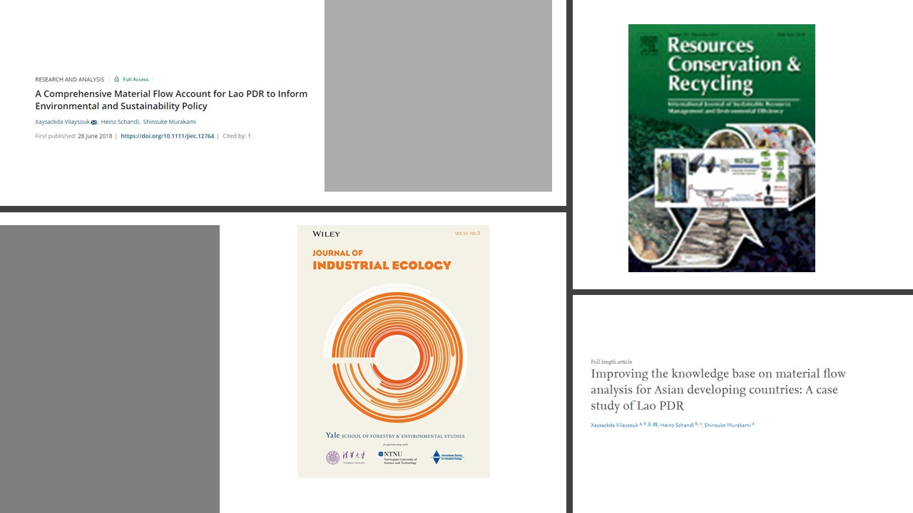
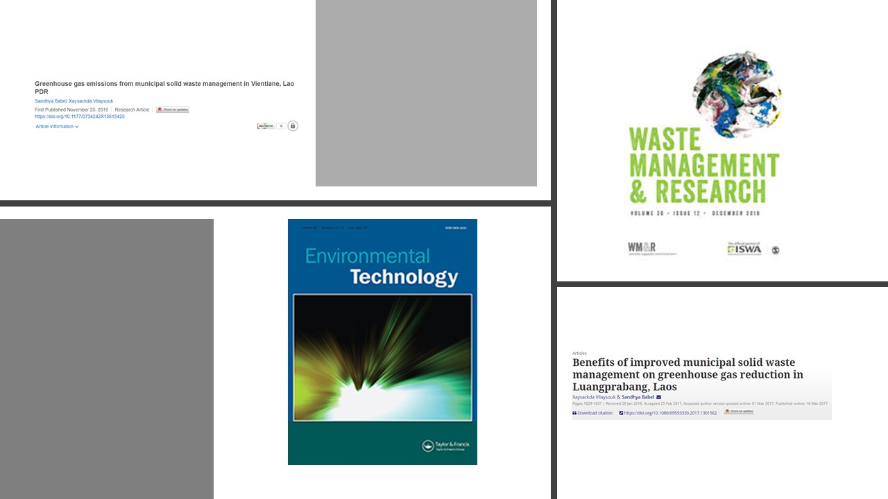

<div align="center">

```{r, out.width='100%', fig.align='center', echo=FALSE}

```


```{r, out.width='100%', fig.align='center', echo=FALSE}
knitr::include_graphics('./img/MFALAOS.png')
```

```{r, out.width='100%', fig.align='center', echo=FALSE}

```
</div>
```{r, out.width='100%', fig.align='center', echo=FALSE}

```

